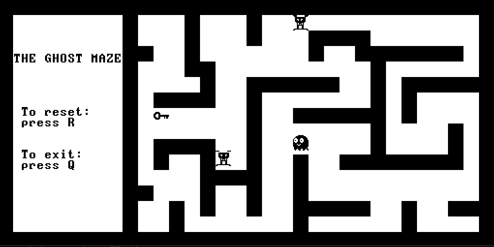

# The Ghost Maze

Help Boo, the ghost who cannot fly through walls, avoid the villains, find the gate key and make her way out of the maze!  

This minimalistic game was created as part of the [nand2tetris](https://www.nand2tetris.org/) course, and is an exercise in writing a fully-functioning graphics oriented program for a primitive low-resources system, using the limited syntax, Object-Oriented Jack programming language.

## Getting Started

These instructions will get a playable copy of the game up and running on your local machine.

### Prerequisites

This game was developed for the Hack virtual computer, and as such must be executed through *VMEmulator*, which comes bundled as part of the free to download nand2tetris software suite.  
The suite itself, as well as detailed usage instructions for the VMEmulator can be found at the link below:

https://www.nand2tetris.org/software

### Running the Game

Once you have the VMEmulator installed locally, save a local copy of the [**TGM**](TGM) compiled directory. Open up VMEmulator and click the  icon at the top left to load the compiled directory into the emulator.   If prompted, click <kbd> Yes </kbd> to allow usage of built-in implementations of called functions.

##### Important: for the game to run properly, you must load the *entire* directory *as is*. Do not select the files individually.

The Animate dropdown selection menu at the top of the screen is set to `Program flow` by default. For the game to run properly, you must select the `No animation` option.

Now press the 
 button to start the game!

### Gameplay

Use the arrow keys to move Boo around the maze and follow the on-screen instructions to play.  
Reach the key to open the gate and make it out of the maze without getting caught by the evil villains!

## Authors

* **Yuval Ginor** - *Initial work* - [yuvgin](https://github.com/yuvgin)
* **Nicole Kezlik** - *Initial work* - [NicoleKezlik](https://github.com/NicoleKezlik)

## License

This project is licensed under the GNU License - see the [LICENSE](LICENSE.md) file for details.  

The nand2tetris software suite is protected under a [Creative Common Attribution-NonCommercial-ShareAlike 3.0 Unported License](https://creativecommons.org/licenses/by-nc-sa/3.0/).  
For more information visit: https://www.nand2tetris.org/license

#### Request & Disclaimer

Please read the following text excerpt, taken from a request by course creators Noam Nisan and Shimon Shocken:

> We developed this course and made all its materials freely available because we want to help people learn applied computer science on their own terms. We believe that students and self-learners who set out to do the hardware and software projects should have the benefit and challenge of doing original work, without seeing published solutions    ...   Please use your judgment and help ensure that many more students, like you, will not be denied the thrill of original work and self-discovery.

After careful judgment and consideration, and due to the unique nature of this project (Project 9), we decided to make it publicly available. This was done to serve as inspiration and to highlight the many possibilities of the Jack programming language and the Hack platform. For this reason, the solutions to all other nand2tetris projects have not been made public.

 If you are currently taking the Nand To Tetris course, we request and highly advise you do your own original work and not use this code or parts of it in your project solutions.  
 The authors and contributors of The Ghost Maze take no responsibility for any infringement repercussions that may incur from using this code, in whole or in part, in your course assignments.  

## Acknowledgments

Special thanks to:

* Golan Parashi for creating the bitmap editor used for generating the optimized sprite artwork for the game.
* The Pacman game series - for inspiration.
